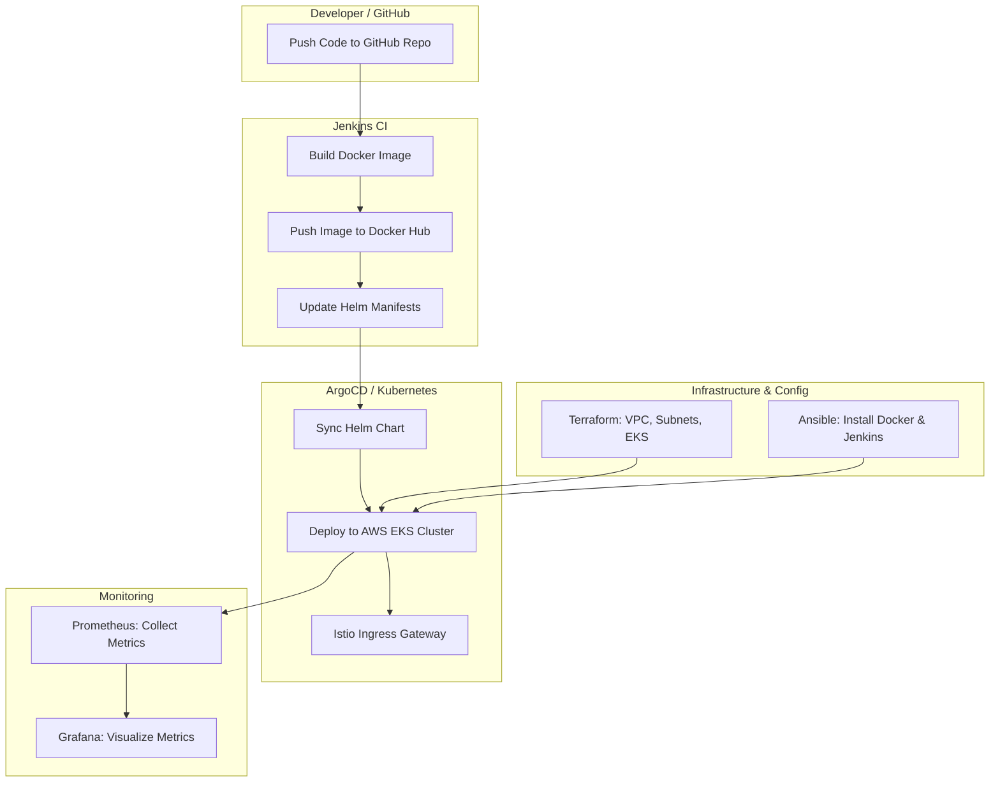

# 🏡 Mini Airbnb – Full Stack DevOps Project

A **Mini Airbnb** clone built to demonstrate **end-to-end Full Stack and DevOps automation** — covering everything from backend APIs to infrastructure automation, CI/CD pipelines, monitoring, and deployment on AWS EKS.

This project is part of my learning journey under **Arth 4.0 by Vimal Daga Sir**. It showcases how different technologies (Full Stack + DevOps + Cloud) come together to build and deploy a real-world scalable application.

---

## 🚀 Project Overview

**Mini Airbnb** is a full-stack web application where users can:

* ✨ Create an account & log in
* 🏠 Add, update, and delete listings
* 💬 Add, update, and delete reviews for listings

The application is powered by **Node.js, Express, MongoDB**, and **EJS templating** for the frontend.

---

## 🧱 Tech Stack

### 🖥️ Full Stack

* **Frontend:** EJS (Embedded JavaScript Templates)
* **Backend:** Node.js + Express.js
* **Database:** MongoDB (Atlas)

### ☁️ Cloud & Infrastructure

* **AWS VPC** with custom subnets, route tables, NAT & Internet gateways
* **AWS EKS** (Elastic Kubernetes Service) created using **Terraform**
* **EC2 (Ubuntu)** for Jenkins, Docker, and Ansible setup

### ⚙️ DevOps Tools

* **Ansible:** Automated Docker & Jenkins installation
* **Jenkins:** CI pipeline for building and pushing Docker images to Docker Hub
* **Helm:** Kubernetes package manager for app deployment
* **ArgoCD:** GitOps-based Continuous Deployment (CD)
* **Istio:** Service Mesh with Ingress Gateway and VirtualService
* **Prometheus & Grafana:** Application and cluster monitoring

---

## 🧩 Folder Structure

```
mini-airbnb/
│
├── controllers/
├── models/
├── routes/
├── views/
├── utils/
├── public/
│
├── infra/                # Terraform and Ansible setup
├── deployment/           # Helm charts and ArgoCD configuration
├── monitor/              # Prometheus & Grafana setup
│
├── app.js
├── Dockerfile
├── Jenkinsfile
├── package.json
├── .gitignore
└── README.md
```

---

## 🧰 Features Implemented

| Category                        | Tools/Tech Used      | Description                                 |
| ------------------------------- | -------------------- | ------------------------------------------- |
| **Infrastructure Provisioning** | Terraform            | Creates AWS VPC, subnets, EKS cluster       |
| **Configuration Management**    | Ansible              | Installs Docker and Jenkins on EC2          |
| **CI Pipeline**                 | Jenkins              | Builds Docker image → Pushes to Docker Hub  |
| **CD Pipeline**                 | ArgoCD               | Deploys Helm chart from GitHub repo         |
| **Service Mesh**                | Istio                | Handles traffic routing and ingress gateway |
| **Monitoring**                  | Prometheus & Grafana | Tracks app and cluster performance          |

---

## ⚡ CI/CD Workflow

1. **Developer pushes code** → GitHub
2. **Jenkins pipeline** triggers:

   * Builds Docker image
   * Pushes image to Docker Hub
   * Updates Helm manifests
3. **ArgoCD** automatically syncs changes → Deploys on **EKS**
4. **Istio Ingress Gateway** routes traffic to the app
5. **Prometheus & Grafana** monitor system metrics

---

### 📐 Project Architecture


---

## 🐳 Deployment Commands (Reference)

### EKS Setup

```bash
aws eks update-kubeconfig --region ap-south-1 --name my-eks-cluster
```

### Helm Setup

```bash
curl -fsSL -o get_helm.sh https://raw.githubusercontent.com/helm/helm/main/scripts/get-helm-3
chmod 700 get_helm.sh && ./get_helm.sh
helm repo update
```

### ArgoCD Setup

```bash
kubectl create namespace argocd
kubectl apply -n argocd -f https://raw.githubusercontent.com/argoproj/argo-cd/stable/manifests/install.yaml
kubectl port-forward svc/argocd-server -n argocd 8080:443
```

### Istio Installation

```bash
curl -L https://istio.io/downloadIstio | ISTIO_VERSION=1.23.0 sh -
cd istio-1.23.0
istioctl install --set profile=demo -y
kubectl label namespace default istio-injection=enabled --overwrite
```

### Helm Deployment

```bash
helm install mini-airbnb ./helm-chart -n default
```

---

## 🧱 Infrastructure Tools

### Terraform

```bash
terraform init
terraform plan
terraform apply
```

### Ansible

**Master Node**

```bash
ssh-keygen -t ed25519 -f ~/.ssh/id_ansible -C "ansible@master" -N ""
scp -i ~/keys/my-ec2.pem ~/.ssh/id_ansible.pub ec2-user@<SLAVE_IP>:/tmp/id_ansible.pub
```

**Slave Node**

```bash
sudo useradd -m -s /bin/bash ansible
sudo mkdir -p /home/ansible/.ssh
sudo mv /tmp/id_ansible.pub /home/ansible/.ssh/authorized_keys
sudo chown -R ansible:ansible /home/ansible/.ssh
sudo chmod 700 /home/ansible/.ssh
sudo chmod 600 /home/ansible/.ssh/authorized_keys
```

**Run Playbook**

```bash
ansible-playbook playbooks/site.yml
```

---

## 📊 Monitoring

* **Prometheus** collects metrics from the Kubernetes cluster.
* **Grafana** visualizes those metrics via dashboards.

These help ensure the health and performance of both the application and infrastructure.

---

## 🎯 Learning Outcomes

Through this project, I gained hands-on experience with:

* Full Stack development using Node.js, Express, MongoDB, and EJS
* Containerization using Docker
* Infrastructure as Code with Terraform
* Configuration management using Ansible
* CI/CD pipeline creation with Jenkins and ArgoCD
* Service Mesh integration with Istio
* Monitoring setup using Prometheus and Grafana
* Deploying a complete project on AWS EKS

---


⭐ *If you liked this project, feel free to star the repo! It motivates me to build more exciting projects.*

---

